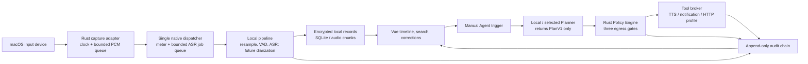

# WordCovenant 产品路线图与执行计划

> **For Codex:** Execute this plan in small, tested changes. Do not add an outbound client, cloud model, runtime auto-download, arbitrary hook, or arbitrary shell execution outside the explicit milestone that permits it.

**目标：** 交付一款 macOS 优先、本地优先的对话记录应用。除非用户在可见界面中主动启用受限出网动作，否则音频、转写、说话人数据和 Agent 上下文均留在设备上。

**架构：** WordCovenant 是模块化的 Tauri 桌面应用。Rust 进程是麦克风访问、采集时间、存储、策略决策、凭据、模型执行和工具执行的唯一所有者。Vue WebView 只渲染投影并发送强类型意图。任何 Agent、技能、钩子、模型、转写和外部响应都只能提出动作建议；未经 Rust 策略与批准路径，不能产生副作用。

**技术栈：** Tauri 2、Rust、Vue 3、TypeScript、Pinia、SQLite/FTS5、macOS Keychain、CoreAudio/CPAL、Metal 加速的本地 ASR、ONNX Runtime、JSON Schema、`tracing` 以及原生 macOS 签名/公证工具。这里列出的本地 ASR、ONNX Runtime 和说话人模型是目标技术栈，不代表已经完成集成或验证。

---

## Product Contract

### Privacy and authority invariants

1. Recording is visible while active. There is no hidden, automatic room recording mode.
2. Audio, transcript, derived speaker embeddings, and Agent context stay local by default.
3. Egress is denied at startup and after every application restart. A network request needs all three gates below:
   - the visible session-level **Allow outbound access** switch is on;
   - the user has approved the exact built-in tool/profile, HTTPS origin, data categories, and duration;
   - the Rust executor re-evaluates the policy immediately before opening a connection.
4. Turning off the visible switch instantly blocks all future egress. Revoking a profile does the same. Neither one deletes local records.
5. WebView CSP/capabilities do not grant network or shell access. A future Rust HTTP client is created only after a successful policy decision.
6. Agent output is typed `PlanV1` data, never executable text. Arbitrary shell commands, arbitrary URLs, native sidecars, and generic MCP tools are not MVP capabilities.
7. 当前 M3.0 仅由用户手动创建和改派会话内匿名簇；自动说话人分离尚未提供。未来若引入显示名称或声纹档案，均必须是明确的用户数据，且绝不能由环境音频推断成身份声明。
8. The current SHA-256 audit chain binds local records and detects modifications that do not recompute the chain. A Keychain-backed seal is required before claiming resistance to an attacker who can rewrite or truncate SQLite; it also does not prove legal enforceability or non-repudiation.

### MVP definition

第一版可用版本是可见的本地录音器：macOS 用户能够开始/停止采集、查看带采集时间戳的最终中文转写片段、手动创建/修正会话内匿名说话人簇、搜索/修正这些片段，并手动触发本地 Agent 动作。受审查的多语种 Whisper `ggml-base.bin` 随 macOS 安装包提供并在本机验证，因此正常离线录音不要求用户下载、导入或填写模型元数据；用户导入的模型只可作为高级本地覆盖。它会在本地历史中显示录音、模型、出网、批准、间隙和动作决策。

Not MVP: automatic human identification from a voiceprint, ambient/background recording, overlap separation guarantees, cloud transcription, runtime automatic model downloads, unattended external actions, generic plugins, legal-contract claims, or a cross-device sync service.

## Current Baseline and Immediate Work

| Status | Work item | Evidence / next exit gate |
| --- | --- | --- |
| Done | M0 application shell | WordCovenant branding, no shell/network Tauri capability, CSP without wildcard connect origins |
| Done | M0 local policy and audit core | Default-deny exact-origin approval checks and SQLite SHA-256 audit chain have unit coverage |
| Done | M0 workspace | Visible local-only/recording state, synthetic browser preview, typed Tauri command path |
| Done | M0 audio boundary | Sample clock, bounded queue, gap events, test source, macOS callback boundary |
| Done | M0.1 explicit egress control | Session-only Rust master gate, visible confirmation/disable UI, and regression coverage; no HTTP client exists |
| Done | M1 lifecycle foundation | Typed permission/recording/interruption state machine behind the macOS callback boundary |
| Awaiting manual acceptance | M1 native input adapter | CoreAudio/CPAL input and microphone lifecycle code exist; the real-device exit gate remains the M1 manual acceptance run. The native source is not yet an ASR ingress. |
| In progress | M2.1 pure Rust/local mock speech pipeline contract | Deterministic local mock PCM exercises the bounded pipeline and final transcript persistence. It does not consume the real CPAL ingress and does not claim a real VAD or `whisper.cpp` adapter. |
| 代码已实现，待真实 macOS 人工验收 | M2.2 native capture-to-inference bridge | 单一 dispatcher、`Starting -> Recording` 两阶段启动、16/48 kHz 预检、有界 ASR job/result 队列、显式 inference gap、drain 与 generation fence 均已实现；它是 M2.3 本地模型运行时的基础，M2.2 单独不代表真实 VAD、`whisper.cpp`/Metal 或模型质量已完成。 |
| 代码已实现，待真实 macOS 人工验收 | M2.3 real local speech experience | macOS 包内受审查的多语种 `ggml-base.bin` 经本机清单、大小和 SHA-256 复验后默认可用；WebRTC VAD、whisper.cpp/Metal、本地最终转写与时间线投影均已接通。高级本地导入只作本次进程覆盖。真实麦克风、模型质量、停止收尾、输入中断和零出网仍须按 M2.3 清单在同一构建上验收。 |
| 代码已实现，完整离线验收就绪 | M3.0 手动匿名说话人修正 | 可在单个会话中创建匿名簇、修订显示名称，并将当前最终转写片段改派或改回未归类。簇、标签和改派均为 SQLite 仅追加记录并绑定审计链；过期、部分、跨会话、无效或已别名目标会被拒绝。它不是自动说话人分离，不含嵌入、声纹/语音档案、置信度、重叠判定或身份声明；合并/拆分的端到端操作也尚未提供。 |

## Target Architecture



### Data and time model

Every capture-derived record carries `session_id`, a monotonic capture range, a wall-clock anchor, a sample rate, a revision number, and model versions. CoreAudio host time / `mach_continuous_time` becomes the source of truth once native capture lands; browser `Date.now()` is display metadata only. Device changes, sleep, source loss, and capture-queue overflow become explicit capture-gap events rather than fabricated continuous time. M2.2 must separately represent inference job/result backpressure as an inference/transcript gap or another range-bearing terminal outcome; it must not silently present that range as continuously transcribed.

The minimum final transcript projection is:

```text
TranscriptSpan {
  id, session_id,
  capture_start_ns, capture_end_ns,
  wall_clock_start,
  speaker_cluster_id: Option<String>,
  text, is_final, revision,
  asr_model_version, diarization_model_version,
  overlap, confidence
}
```

## Delivery Milestones

### M0.1: Visible Egress Gate (completed)

**Outcome:** A local approval record alone is insufficient. A clearly visible, session-only user switch is required before policy can allow outbound behavior.

**Implementation tasks:**

1. Backend gate
   - Modify `src-tauri/src/policy/egress.rs`, `src-tauri/src/state.rs`, `src-tauri/src/commands.rs`, and `src-tauri/src/lib.rs`.
   - Add session-level egress state with default `Disabled`; do not persist an enabled state across app launch.
   - Require that state to be `Enabled` before matching approvals are considered.
   - Add typed `set_egress_enabled` and extend `PrivacyStatus` with `egress_enabled`.
   - Audit enabled/disabled transitions without storing sensitive content.
   - Test: approval plus disabled switch denies; enable plus matching approval allows; disabling again denies; restart defaults to deny.

2. Visible consent surface
   - Modify `src/types.ts`, `src/lib/wordCovenantApi.ts`, `src/stores/privacy.ts`, `src/App.vue`, and add a focused component for the switch/confirmation.
   - The enable confirmation names the fact that data may leave the device and specifies that the switch only permits separately approved profiles.
   - Display active profile count and a direct Disable action at all times. Browser preview remains local fake data only.
   - Test: no one-click implicit enable, cancel leaves disabled, enable refreshes status, disable is immediate.

**Exit gate:** `cargo test`, frontend tests/type-check, and a browser/Tauri UI inspection demonstrate that an approved profile is still denied until a user visibly enables the session switch. No outbound HTTP request is introduced in this milestone.

### M1.0: Capture Lifecycle Foundation (completed)

**Outcome:** The application has a deterministic, UI-safe state model for `Idle`, `AwaitingPermission`, `Recording`, `Interrupted`, and `Failed` before it touches real microphone hardware.

**Delivered:** `CaptureLifecycle` accepts only valid transitions from the existing macOS callback boundary, tracks the selected device and transition time, represents unavailable-device/closed-queue failures as interruptions, and rejects stale-device/invalid transitions without mutation. It intentionally does not request macOS permission or claim that a CoreAudio stream is running.

**Verification:** Deterministic Rust tests cover permission-resolution state, start, device change, interruption, normal stop, device mismatch, and external failure.

### M1: Local Capture Vertical Slice

**Outcome:** A real selected input device produces a local PCM stream, clear recording status, level meter, and durable gap-aware session metadata.

**Tasks:**

1. Add a `CaptureService` lifecycle (`Idle`, `AwaitingPermission`, `Recording`, `Interrupted`, `Failed`) and bind start/stop commands to it.
2. Add `src-tauri/src/audio/cpal_input.rs` behind the current callback boundary. The real-time callback may only enqueue bounded PCM; it cannot run inference, write storage, update UI, or await work.
3. Add `NSMicrophoneUsageDescription`, explicit permission resolution, input-device selection, and source-loss recovery. A restarted source starts a new clock segment, never silently reuses sample offsets.
4. Throttle compact meter and lifecycle events to the WebView; PCM never crosses IPC.
5. Persist session anchors, selected device identifier, sample format, and capture gaps in SQLite.
6. Add microphone permission failure UI and a non-recording recovery state.
7. Add a manual macOS test script covering deny/allow permission, device removal, sleep/wake, and queue overload.

**Acceptance targets:** start/stop affects a real microphone; visible indicator appears before capture; source loss is recorded as a gap; one hour of local capture has no unbounded queue/memory growth; no network dependency is introduced.

### M2: Offline Speech Understanding

**Outcome:** A reviewed local model bundled with macOS releases produces revisioned Chinese transcript spans without runtime downloads; separately imported local models remain optional advanced overrides.

#### M2.1：纯 Rust / 本地 mock 管线合约（进行中）

**边界：** M2.1 只验证开发 mock 产生的本地 `CapturePacket` 如何进入 Rust
管线、如何保留采集时钟，以及 final ASR 响应如何写入既有审计转写存储。
它可以使用确定性 fixture VAD/ASR 来测试接口和时序；fixture 不是实际的
VAD，也不是 `whisper.cpp`/Metal 绑定。M2.1 不会给真实 CPAL ingress 增加第二
个消费者，也不会把真实麦克风 PCM 接入该管线。

**M2.1 验收：** 仅以离线 Rust 单元/集成测试和开发 mock 验证 16 kHz 身份路径、
48 kHz 到 16 kHz 的受限转换、有限 pre-roll/hangover、源时钟不连续、partial 不
持久化及 final 的审计写入。通过这些测试不等于真实 macOS 采集、真实 VAD、真实
ASR 或质量指标已通过。

#### M2.2：真实采集到推理的桥接（代码已实现；真实 macOS 人工验收待执行）

**目标：** 将 M2.1 的本地管线接入真实原生采集，同时保持实时回调、WebView 和未授权
网络路径都不拥有推理或外发能力。M2.2 证明 ingress、生命周期、背压和审计语义的代码
实现；它不声明真实模型质量。

**已实现范围：**

1. 每个活跃原生运行时只有一个 `CaptureDispatcher` 读取 `CaptureIngress`。它同时投影
   紧凑电平并向有界 ASR job 队列分发，PCM 不跨 Tauri IPC、日志、SQLite 或 WebView。
2. 启动使用 `Starting -> Recording` 两阶段：先构造 parked dispatcher 与有界资源并交接
   CPAL，再持久化启动审计束；只有 `arm_after_commit` 成功后才公布 `Recording`。`Starting`
   不会被隐私状态或前端当作正在录音，提交前积压的 PCM 会丢弃；任何阶段失败都会回收
   资源，不伪造会话或时间线。
3. 原生输入目前只预检并支持 16 kHz 与 48 kHz；44.1 kHz 等其他配置明确拒绝，等待独立
   验证的重采样工作，不以静默降级冒充支持。
4. ASR job 与 result 都使用固定容量队列和可观察计数。job/result 饱和分别生成带采集
   范围的 `job_queue_saturated`/`result_queue_saturated` inference gap；缺少可执行本地
   引擎生成 `local_engine_unavailable` gap，不会制造 fixture 文本。gap 与审计事件原子
   绑定，重复持久化可按同一 gap ID 幂等重放。
5. 停止先关闭 CPAL，再 drain ingress、job、worker-held 和 result outcome；每个已接纳
   范围在 `SessionStopped` 前成为 final 或 gap。停止事件使用同一连续采集时钟点，runtime
   generation/segment fence 会拒绝迟到结果进入重启后的会话。
6. 本里程碑没有新增 HTTP 客户端、客户端运行时模型下载或连接开启路径。可见的“允许出网”开关仍是
   任何未来出网的必要条件，匹配审批仍是额外条件；M2.2 本身在开关关闭或开启时都不应
   发起出网。

**待执行出口：** 完成 [M1 macOS 真实采集人工验收清单](2026-08-08-m1-macos-real-capture-manual-acceptance.md)
中的 M2.2-0 至 M2.2-7，并保留同一构建的设备、时钟、队列/gap、generation 和零出网
证据。代码已实现不等于真实硬件验收完成。

**后续本地模型适配：** M2.3 已接入真实 WebRTC VAD 与 `whisper.cpp`/Metal 运行时；
macOS 安装包内置、经审查的多语种 `ggml-base.bin` 会在本机完成清单、大小和 SHA-256
复验后成为默认 ASR，用户无需导入或选择模型就可开始真实麦克风会话。模型注册表保留给
可选高级本地导入，继续记录其文件路径、SHA-256、模型卡/许可证确认、输入格式、大小和
版本；高级覆盖只在当前进程有效。partial 只用于显示，Agent 只能收到不可变 final，修订
不能覆盖原始模型输出。代码接通不等于质量验收，真实模型/硬件/零出网证据见
[M2.3 真实本地语音体验验收清单](2026-08-10-m2-3-real-local-speech-acceptance.md)。

**M2 验收目标：** M2.1 的离线 fixture 测试只证明管线合约；M2.2 的真实 macOS
验收只证明 ingress/队列/时间线语义。包内默认模型的本机完整性与可用状态、可选高级
导入、Agent 只接收 final、可见模型来源以及中文 CER/WER、p95 partial/final 延迟、实时
因子、内存、热/能耗和高级导入时间，仍须由已同意、已授权的 fixture 与实际模型基准
分别证明。

#### M2.3：真实本地语音体验（代码已实现；真实 macOS 人工验收待执行）

**结果：** macOS 安装包内置、经审查的多语种 Whisper `ggml-base.bin` 在本机验证后即为
默认 ASR；正常录音无需用户下载、导入或填写模型元数据。真实麦克风经过 WebRTC VAD 和
独立的本地 Whisper worker 后，最终中文转写通过既有 SQLite/审计事务写入时间线。原生文件
导入只保留为高级本地模型的临时覆盖。此结果只描述匿名、最终的语音转文字路径，不描述
自动说话人区分。

**已实现范围：**

1. 内置默认模型使用精确的 `whisper.cpp-ggml` 格式。应用启动时会将包内
   `manifest.json` 与编译进可执行文件的审查锁逐项比对，并校验常规文件、大小和 SHA-256；
   每次加载前还会重新校验。资源绝对路径是 native-only 能力，不会跨 Tauri IPC，也不会
   被写成用户导入或导入审计记录。
2. 内置默认模型验证成功后自动成为当前进程的活动 ASR，用户只需主动开始录音。资源缺失、
   清单/格式/哈希不一致或加载失败均在麦克风准备前失败关闭，不生成 fixture/synthetic
   文本，也不回退到云端或系统识别。用户可显式选择兼容的高级本地导入模型作本次进程覆盖，
   重启后恢复内置默认模型。
3. WebRTC VAD 只处理原生内存中的 16 kHz 单声道 10 ms 帧；临时 `i16` PCM 不序列化、
   不写入 SQLite、审计记录、日志或 WebView。Whisper 仅产生带经验证模型来源的中文
   final 记录，禁用翻译与自动语言检测。
4. 单一 dispatcher 仍是唯一 PCM 消费者。Whisper context 属于有界、单 worker 的 ASR
   路径，避免模型推理阻塞 CoreAudio 回调；最终结果只以会话 ID 与修订号投影给前端，
   前端再从本地 SQLite 查询时间线。
5. 停止、队列饱和、模型失败、文件篡改和输入中断均须成为最终转写或范围明确的 gap，
   而不是静默丢弃或伪造连续记录。runtime generation fence 拒绝迟到结果。
6. 已安装客户端没有 HTTP 模型客户端、模型 URL、运行时自动下载、更新、恢复、云 ASR
   或出网回退。发布/CI 仅可在显式构建步骤中取得已锁定的工件；应用启动后仍默认拒绝
   出网，即使用户日后显式打开会话开关，M2.3 路径也不应建立网络连接。

**人工验收出口：** 必须在同一可识别构建上完成
[M2.3 真实本地语音体验验收清单](2026-08-10-m2-3-real-local-speech-acceptance.md)，
记录包内模型清单/SHA/许可证证据、16/48 kHz 设备、允许/拒绝权限、安静/中文语句、
静音、停止中语句、篡改模型和进程级零出网观察。没有这些硬件记录时，不能宣称真实转写
质量已经验收。

**M2.3 明确不提供：** 自动说话人区分、自动聚类、声纹/语音档案、声纹匹配、真实身份
识别、跨会话关联、重叠说话分离、嵌入持久化或客户端运行时模型下载。当前人工匿名簇
工作流保持为后续的人工修正入口，不能作为自动说话人能力的证据。

### M3.0：手动匿名说话人修正（代码已实现，完整离线验收就绪）

**结果：** 时间线中的当前最终转写片段可由用户手动归入会话内匿名簇，或改回未归类。系统不从音频自动推断说话人，也不宣称任何簇对应真实的人。

**已实现范围：**

1. 每个簇都使用会话内、不含身份信息的本地不透明 ID 和匿名序号；初始标签以及之后的用户输入标签都是显示元数据，不是身份声明。
2. 簇、标签修订和可用的别名基础记录均使用本地 SQLite 的仅追加表和修订链保存，并绑定 SHA-256 审计事件。历史转写和名称不会被原地覆盖。
3. 前端以扁平的管理面板显示目录。用户可创建匿名簇、重命名当前簇，并把一个当前最终版转写片段改派给活动匿名簇或改回未归类。
4. 改派会创建一条 `UserEdited` 最终转写修订和一个专用审计事件，同时保留文本、采集时间、墙上时钟时间和模型来源。请求必须携带当前修订；过期、部分、未知、跨会话、无效或已别名目标都会在写入前被拒绝。
5. 原始 PCM 不会跨 Tauri IPC 进入 WebView，也不会写入 SQLite、审计记录或日志。M3.0 没有 PCM 查看、导出或调试接口。

**M3.0 明确不提供：** 自动说话人分离或自动聚类、嵌入向量、声纹/语音档案、声纹匹配、跨会话关联、置信度、重叠/不确定性判定、真实身份确认或声明。用户输入的名称不改变这一边界。合并和拆分的端到端用户命令与界面也不属于当前实现，虽有仅追加别名数据模型基础，但不能据此宣称此功能可用。

**出网与模型边界：** M3.0 未新增 HTTP 客户端、客户端运行时模型下载或出网请求。应用启动和重启后仍默认拒绝出网；即使用户日后主动打开本次会话的可见出网总开关，也仍需要匹配的具名工具、HTTPS 源站和数据范围审批。说话人修正本身不会因开关状态而请求网络。

**离线验收门槛：** 以下矩阵必须在不触发客户端运行时模型下载、不创建网络客户端、不暴露 PCM 且不改变默认出网拒绝行为的前提下通过，才能将 M3.0 标记为已验收：

```sh
cargo fmt --manifest-path src-tauri/Cargo.toml --check
cargo test --manifest-path src-tauri/Cargo.toml --offline
cargo check --manifest-path src-tauri/Cargo.toml --release --offline
pnpm test --run
pnpm type-check
pnpm build
git diff --check
```

### M3 后续：本地说话人分离的独立研究与验收（未开始）

未来的本地说话人分离必须另行设计和批准，不能把 M3.0 的人工修正当作自动归因能力。前置条件包括：明确的生物特征数据威胁模型、用户同意与删除/重新登记流程、完全本地的嵌入适配器、经许可且获同意的测试样本、歧义阈值以及说话人分离错误率和误归类率基准。通过后仍只能分配匿名簇，不能自动声明真实个人身份。

### M4: Agent Actions and Controlled Tools

**Outcome:** A manually invoked Agent can select approved local context, propose typed actions, and execute only after the policy/approval path.

**Tasks:**

1. Add `ContextSelector` with explicit session/span selection and redaction preview. Default context is final local spans only.
2. Add a `Planner` trait and strict JSON `PlanV1` validator. Local planner adapters come first; a cloud planner itself is an outbound profile and cannot bypass egress controls.
3. Add `ToolBroker` with local TTS and notification executors. TTS uses fixed native APIs/arguments, not a shell string; playback pauses transcript-triggered actions to prevent feedback loops.
4. Implement named HTTP profiles with fixed HTTPS origin, method, request/response schemas, byte limits, timeout, retry rules, idempotency key, and Keychain credential references.
5. Add per-action confirmation UI showing tool/version, destination, data categories, redacted payload summary, scope/duration, and audit run ID.
6. Wire an actual HTTP client only here, after policy revalidation immediately before sending. Treat remote responses as untrusted data.

**Acceptance targets:** every action can be traced from selected spans through plan, approval, policy, tool result, and audit record; switch-off/revocation wins over a queued action; no model can mint permissions.

### M5: Declarative Skills and Constrained Hooks

**Outcome:** Users can add capabilities without giving arbitrary code unreviewed authority.

**Tasks:**

1. Define declarative skills as `manifest.json`, `SKILL.md`, JSON Schema, declared data categories, and named built-in tools. Validate content hash and schema before loading.
2. Provide only proposal-producing hook events: `on_transcript_finalized`, `on_manual_trigger`, `before_tool_call`, `after_tool_call`, `on_run_finished`.
3. Add causation IDs, recursion limits, idempotency keys, output-size limits, and audit records for every hook proposal.
4. Package signed skills (`.wcpkg`, Ed25519) and show signer/version/hash. Signature is provenance, not permission.
5. Only after the declarative model is reliable, evaluate an opt-in Wasmtime hook sandbox with no filesystem, environment, network, or preopened directories and strict fuel/memory/time limits.

**Acceptance targets:** a skill can propose but cannot execute; unsigned/untrusted input cannot escape declared schemas; hooks cannot loop indefinitely or receive unfiltered raw context.

### M6: Data Protection, Evidence, and Release Operations

**Outcome:** The application supports durable local ownership, recovery, carefully scoped export, and macOS release quality.

**Tasks:**

1. Put database/audio encryption keys in Keychain; add SQLCipher or field-level AEAD after an explicit threat-model review.
2. Add raw-audio opt-in, encrypted chunk storage, retention schedules, deletion proof/audit entries, and storage quota UX.
3. Create an export manifest with record hashes, audit-chain verification result, model/tool versions, redaction options, and detached signatures where appropriate. Do not call it legal proof.
4. Add backup/restore, integrity verification, corruption handling, and migrations.
5. Add structured local `tracing` with secret/transcript redaction; opt-in diagnostics are a separate egress profile.
6. Sign, notarize, sandbox, and test the macOS bundle; publish a clear microphone/biometric/privacy notice and release checklist.

**Acceptance targets:** a user can inspect, export, retain, and delete their local data; restore detects tampering/corruption; release builds pass signed/notarized macOS smoke tests.

## Dependencies and Parallelization

```text
M0.1 egress gate -------------------------------------------> M4 HTTP profiles
M1 native input ---------------------------------------------+
M2.1 pure Rust/mock contract --------------------------------+--> M2.2 dispatcher + queues --> native VAD/ASR --> future automatic diarization
M2 model registry -------------------------------------------+
M2 final transcript events --------------------------------------> M3.0 manual catalog/corrections --> M4 Agent context --> M5 declarative skills
M0 audit core ---------------------------------------------------> M4 / M5 / M6
M1 permission/release work -------------------------------------> M6 notarization
```

可安全并行的单元包括仅 UI 的策略投影、纯 Rust 策略测试、M2.1 fixture/基准工具、M3.0 手动目录/修正和文档。M2.1 在确定性契约被测试期间可以保持独立于真实 CPAL 消费者。必须保持顺序的工作包括：M2.2 的单一 dispatcher 必须先于任何原生 ASR 消费者；两阶段启动与有界 job/result 队列必须先于 M2.2 硬件验收；真实 VAD/ASR 绑定和模型基准必须在桥接后进行；自动说话人分离、嵌入或任何声纹档案必须在独立隐私设计、同意流程和基准之后进行；实际 HTTP 客户端必须在 M0.1+M4 策略/批准路径后引入；可执行钩子必须在声明式技能之后引入；加密迁移必须在威胁模型决策后进行。

## Non-Functional Gates

| Area | Initial target | How it is checked |
| --- | --- | --- |
| Privacy | Zero egress with switch off | Unit/integration test plus local network monitor during manual test |
| Capture time | No fabricated continuity across input gaps | Clock/gap unit tests and sleep/device manual scenarios |
| UI | Recording and egress state always visible | Component tests, desktop screenshot/manual QA |
| Audio latency | Benchmark before promising a target; record p95 and RTF per model/device | Versioned local benchmark report |
| Reliability | No unbounded audio queue; recoverable device loss | Stress fixture, queue-overrun and unplug tests |
| Inference bridge | One PCM dispatcher; bounded job/result queues; every overload range has an explicit outcome | Offline queue tests plus M2.2 real-macOS pressure run |
| Data integrity | Audit chain verifies on open | Tamper/reopen tests |
| Accessibility | Keyboard usable controls and programmatic labels | Component tests plus manual VoiceOver pass |
| Release | Signed/notarized macOS bundle | CI/release checklist and clean-machine smoke test |

## Risk Register

| Risk | Mitigation | Release decision |
| --- | --- | --- |
| Recording/biometric law differs by place | Visible recording, anonymous clusters by default, consent/revocation/deletion, jurisdiction-specific legal review | Block broad release until legal review |
| Single mic cannot separate overlap reliably | Label uncertainty/overlap; do not infer a speaker | Never advertise guaranteed attribution |
| Model license or weights restrict use | 审查并记录包内模型的来源/许可证；高级导入仍记录用户确认 | 阻止未审查模型进入默认发布包 |
| UI switch is bypassed by backend/plugin | Central Rust gate, static deny-by-default capabilities, regression tests | Block release on any bypass |
| TTS feeds back into transcription/Agent | Pause triggering during local playback; later add AEC/source tagging | Limit MVP behavior until tested |
| Native sidecars inherit user rights | Exclude from normal product; developer mode only after design review | Do not ship in MVP |

## Verification Matrix

Run after each change set:

```sh
pnpm test --run
pnpm type-check
pnpm build
cargo fmt --manifest-path src-tauri/Cargo.toml --check
cargo test --manifest-path src-tauri/Cargo.toml
cargo check --manifest-path src-tauri/Cargo.toml
```

M2.1 may be verified through its offline Rust/mock matrix, but that result is not hardware acceptance. Before marking M1, M2.2, or any real-model path complete, run the applicable macOS manual scenarios and record machine model, macOS version, input device, permission result, expected/observed event sequence, queue/gap evidence where applicable, and whether any local network monitor observed egress. Do not mark an untested hardware/model path complete based solely on compilation.
