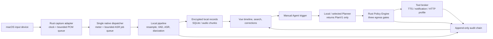

# WordCovenant Product Roadmap and Execution Plan

> **For Codex:** Execute this plan in small, tested changes. Do not add an outbound client, cloud model, auto-download, arbitrary hook, or arbitrary shell execution outside the explicit milestone that permits it.

**Goal:** Deliver a macOS-first, local-first conversation record application whose audio, transcript, speaker data, and Agent context remain on-device unless the user visibly enables a narrowly scoped outbound action.

**Architecture:** WordCovenant is a modular Tauri desktop application. The Rust process is the sole owner of microphone access, capture time, storage, policy decisions, credentials, model execution, and tool execution. The Vue WebView only renders projections and sends typed intents. Every Agent, skill, hook, model, transcript, and external response may create an action proposal but cannot cause a side effect without the Rust policy and approval path.

**Tech Stack:** Tauri 2, Rust, Vue 3, TypeScript, Pinia, SQLite/FTS5, macOS Keychain, CoreAudio/CPAL, Metal-accelerated local ASR, ONNX Runtime, JSON Schema, `tracing`, and native macOS signing/notarization tooling.

---

## Product Contract

### Privacy and authority invariants

1. Recording is visible while active. There is no hidden, automatic room recording mode.
2. Audio, transcript, derived speaker embeddings, and Agent context stay local by default.
3. Egress is denied at startup and after every application restart. A network request needs all three gates below:
   - the visible session-level **Allow outbound access** switch is on;
   - the user has approved the exact built-in tool/profile, HTTPS origin, data categories, and duration;
   - the Rust executor re-evaluates the policy immediately before opening a connection.
4. Turning off the visible switch instantly blocks all future egress. Revoking a profile does the same. Neither one deletes local records.
5. WebView CSP/capabilities do not grant network or shell access. A future Rust HTTP client is created only after a successful policy decision.
6. Agent output is typed `PlanV1` data, never executable text. Arbitrary shell commands, arbitrary URLs, native sidecars, and generic MCP tools are not MVP capabilities.
7. Diarization initially assigns anonymous clusters. A display name or voiceprint profile is explicit user data, not an identity claim inferred from ambient audio.
8. The current SHA-256 audit chain binds local records and detects modifications that do not recompute the chain. A Keychain-backed seal is required before claiming resistance to an attacker who can rewrite or truncate SQLite; it also does not prove legal enforceability or non-repudiation.

### MVP definition

The first usable release is a visible local recorder that lets a macOS user start/stop capture, see final Chinese transcript spans with capture-time timestamps and anonymous speaker clusters, search/correct those spans, and manually trigger a local Agent action. It works offline after the user imports local models. It shows all recording, model, egress, approval, gap, and action decisions in local history.

Not MVP: automatic human identification from a voiceprint, ambient/background recording, overlap separation guarantees, cloud transcription, automatic model downloads, unattended external actions, generic plugins, legal-contract claims, or a cross-device sync service.

## Current Baseline and Immediate Work

| Status | Work item | Evidence / next exit gate |
| --- | --- | --- |
| Done | M0 application shell | WordCovenant branding, no shell/network Tauri capability, CSP without wildcard connect origins |
| Done | M0 local policy and audit core | Default-deny exact-origin approval checks and SQLite SHA-256 audit chain have unit coverage |
| Done | M0 workspace | Visible local-only/recording state, synthetic browser preview, typed Tauri command path |
| Done | M0 audio boundary | Sample clock, bounded queue, gap events, test source, macOS callback boundary |
| Done | M0.1 explicit egress control | Session-only Rust master gate, visible confirmation/disable UI, and regression coverage; no HTTP client exists |
| Done | M1 lifecycle foundation | Typed permission/recording/interruption state machine behind the macOS callback boundary |
| Awaiting manual acceptance | M1 native input adapter | CoreAudio/CPAL input and microphone lifecycle code exist; the real-device exit gate remains the M1 manual acceptance run. The native source is not yet an ASR ingress. |
| In progress | M2.1 pure Rust/local mock speech pipeline contract | Deterministic local mock PCM exercises the bounded pipeline and final transcript persistence. It does not consume the real CPAL ingress and does not claim a real VAD or `whisper.cpp` adapter. |
| Pending | M2.2 native capture-to-inference bridge | Replace the current single-consumer meter path with one dispatcher, use two-phase startup and bounded ASR job/result queues, define backpressure/inference-gap behavior, then complete a real macOS manual run. |

## Target Architecture



### Data and time model

Every capture-derived record carries `session_id`, a monotonic capture range, a wall-clock anchor, a sample rate, a revision number, and model versions. CoreAudio host time / `mach_continuous_time` becomes the source of truth once native capture lands; browser `Date.now()` is display metadata only. Device changes, sleep, source loss, and capture-queue overflow become explicit capture-gap events rather than fabricated continuous time. M2.2 must separately represent inference job/result backpressure as an inference/transcript gap or another range-bearing terminal outcome; it must not silently present that range as continuously transcribed.

The minimum final transcript projection is:

```text
TranscriptSpan {
  id, session_id,
  capture_start_ns, capture_end_ns,
  wall_clock_start,
  speaker_cluster_id: Option<String>,
  text, is_final, revision,
  asr_model_version, diarization_model_version,
  overlap, confidence
}
```

## Delivery Milestones

### M0.1: Visible Egress Gate (completed)

**Outcome:** A local approval record alone is insufficient. A clearly visible, session-only user switch is required before policy can allow outbound behavior.

**Implementation tasks:**

1. Backend gate
   - Modify `src-tauri/src/policy/egress.rs`, `src-tauri/src/state.rs`, `src-tauri/src/commands.rs`, and `src-tauri/src/lib.rs`.
   - Add session-level egress state with default `Disabled`; do not persist an enabled state across app launch.
   - Require that state to be `Enabled` before matching approvals are considered.
   - Add typed `set_egress_enabled` and extend `PrivacyStatus` with `egress_enabled`.
   - Audit enabled/disabled transitions without storing sensitive content.
   - Test: approval plus disabled switch denies; enable plus matching approval allows; disabling again denies; restart defaults to deny.

2. Visible consent surface
   - Modify `src/types.ts`, `src/lib/wordCovenantApi.ts`, `src/stores/privacy.ts`, `src/App.vue`, and add a focused component for the switch/confirmation.
   - The enable confirmation names the fact that data may leave the device and specifies that the switch only permits separately approved profiles.
   - Display active profile count and a direct Disable action at all times. Browser preview remains local fake data only.
   - Test: no one-click implicit enable, cancel leaves disabled, enable refreshes status, disable is immediate.

**Exit gate:** `cargo test`, frontend tests/type-check, and a browser/Tauri UI inspection demonstrate that an approved profile is still denied until a user visibly enables the session switch. No outbound HTTP request is introduced in this milestone.

### M1.0: Capture Lifecycle Foundation (completed)

**Outcome:** The application has a deterministic, UI-safe state model for `Idle`, `AwaitingPermission`, `Recording`, `Interrupted`, and `Failed` before it touches real microphone hardware.

**Delivered:** `CaptureLifecycle` accepts only valid transitions from the existing macOS callback boundary, tracks the selected device and transition time, represents unavailable-device/closed-queue failures as interruptions, and rejects stale-device/invalid transitions without mutation. It intentionally does not request macOS permission or claim that a CoreAudio stream is running.

**Verification:** Deterministic Rust tests cover permission-resolution state, start, device change, interruption, normal stop, device mismatch, and external failure.

### M1: Local Capture Vertical Slice

**Outcome:** A real selected input device produces a local PCM stream, clear recording status, level meter, and durable gap-aware session metadata.

**Tasks:**

1. Add a `CaptureService` lifecycle (`Idle`, `AwaitingPermission`, `Recording`, `Interrupted`, `Failed`) and bind start/stop commands to it.
2. Add `src-tauri/src/audio/cpal_input.rs` behind the current callback boundary. The real-time callback may only enqueue bounded PCM; it cannot run inference, write storage, update UI, or await work.
3. Add `NSMicrophoneUsageDescription`, explicit permission resolution, input-device selection, and source-loss recovery. A restarted source starts a new clock segment, never silently reuses sample offsets.
4. Throttle compact meter and lifecycle events to the WebView; PCM never crosses IPC.
5. Persist session anchors, selected device identifier, sample format, and capture gaps in SQLite.
6. Add microphone permission failure UI and a non-recording recovery state.
7. Add a manual macOS test script covering deny/allow permission, device removal, sleep/wake, and queue overload.

**Acceptance targets:** start/stop affects a real microphone; visible indicator appears before capture; source loss is recorded as a gap; one hour of local capture has no unbounded queue/memory growth; no network dependency is introduced.

### M2: Offline Speech Understanding

**Outcome:** Explicitly installed local models produce revisioned Chinese transcript spans without automatic downloads.

#### M2.1：纯 Rust / 本地 mock 管线合约（进行中）

**边界：** M2.1 只验证开发 mock 产生的本地 `CapturePacket` 如何进入 Rust
管线、如何保留采集时钟，以及 final ASR 响应如何写入既有审计转写存储。
它可以使用确定性 fixture VAD/ASR 来测试接口和时序；fixture 不是实际的
VAD，也不是 `whisper.cpp`/Metal 绑定。M2.1 不会给真实 CPAL ingress 增加第二
个消费者，也不会把真实麦克风 PCM 接入该管线。

**M2.1 验收：** 仅以离线 Rust 单元/集成测试和开发 mock 验证 16 kHz 身份路径、
48 kHz 到 16 kHz 的受限转换、有限 pre-roll/hangover、源时钟不连续、partial 不
持久化及 final 的审计写入。通过这些测试不等于真实 macOS 采集、真实 VAD、真实
ASR 或质量指标已通过。

#### M2.2：真实采集到推理的桥接（待实现）

**目标：** 把 M2.1 的本地管线接到真实原生采集，但不让实时回调、WebView 或任意
未授权的网络路径拥有推理或外发能力。M2.2 是 ingress、生命周期和背压的工作，
不是对真实模型质量的声明。

**必做项：**

1. 用一个原生 dispatcher 取代当前 `CaptureIngress` 的单一电平消费者。该 dispatcher
   是唯一读取 PCM 的位置，并向紧凑电平投影和 ASR job 路径分发；不得通过第二个
   `try_consume` 循环竞争同一队列。
2. 实现两阶段启动：先创建会话、dispatcher 与所有有界工作资源且不公布 `Recording`；
   仅在这些资源就绪后启动/交接 CPAL 流，并在交接成功后才公布录音状态。任一阶段
   失败都必须回收已创建资源，保留非录音的可见状态，且不伪造时间线。
3. 为 ASR job 和 result 各建立有界队列，定义容量、停止语义和可观察计数。job 或
   result 满时的行为必须是显式的背压和带采集范围的 inference/transcript gap（或
   等价的可审计终态），不能无声丢弃，也不能让回调阻塞或让内存无界增长。
4. 保持 PCM 不跨 Tauri IPC；回调仍只做有限归一化和入队，推理、持久化、UI 更新都
   在回调之外执行。停止、设备丢失和重启期间，未完成范围要么按已定义顺序完成，
   要么被明确标记为未推理/缺口。
5. 完成 [M1 macOS 真实采集人工验收清单](2026-08-08-m1-macos-real-capture-manual-acceptance.md)
   中新增的 M2.2 追加场景；没有同一构建的真实硬件记录，不得把桥接路径标记为完成。

**后续本地模型适配：** 真实 VAD 与 `whisper.cpp`/Metal 仍是 M2 的独立工作，必须
在选定模型、显式导入和本地基准完成后才可宣称可用。模型注册表继续记录文件路径、
SHA-256、模型卡/许可证确认、输入格式、大小和版本；partial 只用于显示，Agent
只能收到不可变 final，修订不能覆盖原始模型输出。

**M2 验收目标：** M2.1 的离线 fixture 测试只证明管线合约；M2.2 的真实 macOS
验收只证明 ingress/队列/时间线语义。离线模型导入、Agent 只接收 final、可见模型
来源以及中文 CER/WER、p95 partial/final 延迟、实时因子、内存、热/能耗和导入时间，
仍须由已同意、已授权的 fixture 与实际模型基准分别证明。

### M3: Speaker Workflow

**Outcome:** The timeline groups sufficiently clear non-overlapping speech into anonymous, correctable clusters.

**Tasks:**

1. Add local speaker embedding adapter and online cosine-similarity clustering with a calibrated ambiguity threshold.
2. Persist an embedding reference/hash separately from transcript projection; encrypt or delete it with the cluster.
3. Show `Speaker 1/2/...`, confidence, overlap/uncertain labels, and manual rename/merge/split controls.
4. Require an explicit consent flow for mapping an anonymous cluster to a profile. Support deletion, re-enrolment, and all related audit events.
5. Benchmark diarization error rate and wrong-assignment rate on consented, licensed fixtures; test ambiguity paths.

**Acceptance targets:** no automatic personal-name assertion; overlapping/uncertain speech remains visibly uncertain; edits are revisioned and reversible.

### M4: Agent Actions and Controlled Tools

**Outcome:** A manually invoked Agent can select approved local context, propose typed actions, and execute only after the policy/approval path.

**Tasks:**

1. Add `ContextSelector` with explicit session/span selection and redaction preview. Default context is final local spans only.
2. Add a `Planner` trait and strict JSON `PlanV1` validator. Local planner adapters come first; a cloud planner itself is an outbound profile and cannot bypass egress controls.
3. Add `ToolBroker` with local TTS and notification executors. TTS uses fixed native APIs/arguments, not a shell string; playback pauses transcript-triggered actions to prevent feedback loops.
4. Implement named HTTP profiles with fixed HTTPS origin, method, request/response schemas, byte limits, timeout, retry rules, idempotency key, and Keychain credential references.
5. Add per-action confirmation UI showing tool/version, destination, data categories, redacted payload summary, scope/duration, and audit run ID.
6. Wire an actual HTTP client only here, after policy revalidation immediately before sending. Treat remote responses as untrusted data.

**Acceptance targets:** every action can be traced from selected spans through plan, approval, policy, tool result, and audit record; switch-off/revocation wins over a queued action; no model can mint permissions.

### M5: Declarative Skills and Constrained Hooks

**Outcome:** Users can add capabilities without giving arbitrary code unreviewed authority.

**Tasks:**

1. Define declarative skills as `manifest.json`, `SKILL.md`, JSON Schema, declared data categories, and named built-in tools. Validate content hash and schema before loading.
2. Provide only proposal-producing hook events: `on_transcript_finalized`, `on_manual_trigger`, `before_tool_call`, `after_tool_call`, `on_run_finished`.
3. Add causation IDs, recursion limits, idempotency keys, output-size limits, and audit records for every hook proposal.
4. Package signed skills (`.wcpkg`, Ed25519) and show signer/version/hash. Signature is provenance, not permission.
5. Only after the declarative model is reliable, evaluate an opt-in Wasmtime hook sandbox with no filesystem, environment, network, or preopened directories and strict fuel/memory/time limits.

**Acceptance targets:** a skill can propose but cannot execute; unsigned/untrusted input cannot escape declared schemas; hooks cannot loop indefinitely or receive unfiltered raw context.

### M6: Data Protection, Evidence, and Release Operations

**Outcome:** The application supports durable local ownership, recovery, carefully scoped export, and macOS release quality.

**Tasks:**

1. Put database/audio encryption keys in Keychain; add SQLCipher or field-level AEAD after an explicit threat-model review.
2. Add raw-audio opt-in, encrypted chunk storage, retention schedules, deletion proof/audit entries, and storage quota UX.
3. Create an export manifest with record hashes, audit-chain verification result, model/tool versions, redaction options, and detached signatures where appropriate. Do not call it legal proof.
4. Add backup/restore, integrity verification, corruption handling, and migrations.
5. Add structured local `tracing` with secret/transcript redaction; opt-in diagnostics are a separate egress profile.
6. Sign, notarize, sandbox, and test the macOS bundle; publish a clear microphone/biometric/privacy notice and release checklist.

**Acceptance targets:** a user can inspect, export, retain, and delete their local data; restore detects tampering/corruption; release builds pass signed/notarized macOS smoke tests.

## Dependencies and Parallelization

```text
M0.1 egress gate -------------------------------------------> M4 HTTP profiles
M1 native input ---------------------------------------------+
M2.1 pure Rust/mock contract --------------------------------+--> M2.2 dispatcher + queues --> native VAD/ASR --> M3 clustering
M2 model registry -------------------------------------------+
M2 final transcript events --------------------------------------> M4 Agent context --> M5 declarative skills
M0 audit core ---------------------------------------------------> M4 / M5 / M6
M1 permission/release work -------------------------------------> M6 notarization
```

The safe parallel units are UI-only policy projections, pure Rust policy tests, M2.1 fixture/benchmark tooling, and documentation. M2.1 may remain independent of the real CPAL consumer while its deterministic contract is tested. The following must stay sequenced: M2.2's single dispatcher before any native ASR consumer; two-phase startup and bounded job/result queues before M2.2 hardware acceptance; real VAD/ASR bindings and model benchmarks after the bridge; actual HTTP client after M0.1+M4 policy/approval paths; voiceprint naming after anonymous clustering; executable hooks after declarative skills; encryption migration after a threat-model decision.

## Non-Functional Gates

| Area | Initial target | How it is checked |
| --- | --- | --- |
| Privacy | Zero egress with switch off | Unit/integration test plus local network monitor during manual test |
| Capture time | No fabricated continuity across input gaps | Clock/gap unit tests and sleep/device manual scenarios |
| UI | Recording and egress state always visible | Component tests, desktop screenshot/manual QA |
| Audio latency | Benchmark before promising a target; record p95 and RTF per model/device | Versioned local benchmark report |
| Reliability | No unbounded audio queue; recoverable device loss | Stress fixture, queue-overrun and unplug tests |
| Inference bridge | One PCM dispatcher; bounded job/result queues; every overload range has an explicit outcome | Offline queue tests plus M2.2 real-macOS pressure run |
| Data integrity | Audit chain verifies on open | Tamper/reopen tests |
| Accessibility | Keyboard usable controls and programmatic labels | Component tests plus manual VoiceOver pass |
| Release | Signed/notarized macOS bundle | CI/release checklist and clean-machine smoke test |

## Risk Register

| Risk | Mitigation | Release decision |
| --- | --- | --- |
| Recording/biometric law differs by place | Visible recording, anonymous clusters by default, consent/revocation/deletion, jurisdiction-specific legal review | Block broad release until legal review |
| Single mic cannot separate overlap reliably | Label uncertainty/overlap; do not infer a speaker | Never advertise guaranteed attribution |
| Model license or weights restrict use | Record model provenance/license at import | Block model from production registry |
| UI switch is bypassed by backend/plugin | Central Rust gate, static deny-by-default capabilities, regression tests | Block release on any bypass |
| TTS feeds back into transcription/Agent | Pause triggering during local playback; later add AEC/source tagging | Limit MVP behavior until tested |
| Native sidecars inherit user rights | Exclude from normal product; developer mode only after design review | Do not ship in MVP |

## Verification Matrix

Run after each change set:

```sh
pnpm test --run
pnpm type-check
pnpm build
cargo fmt --manifest-path src-tauri/Cargo.toml --check
cargo test --manifest-path src-tauri/Cargo.toml
cargo check --manifest-path src-tauri/Cargo.toml
```

M2.1 may be verified through its offline Rust/mock matrix, but that result is not hardware acceptance. Before marking M1, M2.2, or any real-model path complete, run the applicable macOS manual scenarios and record machine model, macOS version, input device, permission result, expected/observed event sequence, queue/gap evidence where applicable, and whether any local network monitor observed egress. Do not mark an untested hardware/model path complete based solely on compilation.
